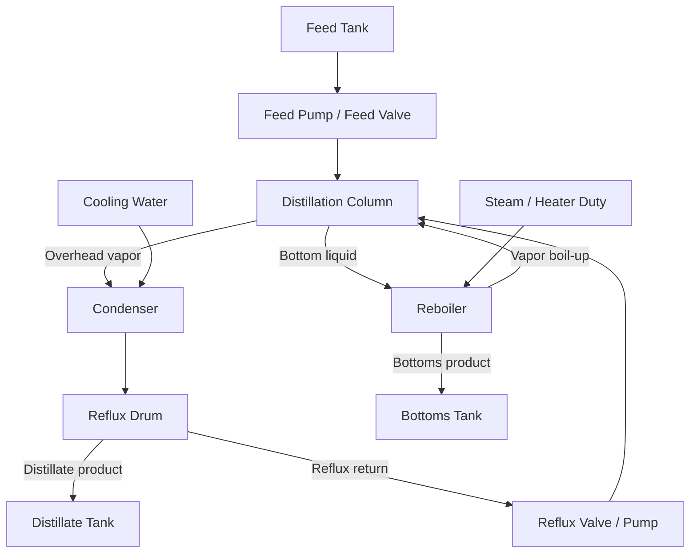

# Chemical Distillation Column Processing Introduction

Use case: Modern Developments in Industry group assignment  
Recommended topic: chemical distillation column digital twin  
Purpose: can be directly adapted into a README process introduction, report section, or demo presentation background section

## 1. Why choose distillation as the assignment topic

Distillation is one of the most typical, fundamental, and digital-twin-friendly industrial processes in the chemical, petrochemical, oil refining, pharmaceutical, food and beverage, solvent recovery, and environmental treatment industries. It does not assemble discrete parts into countable products. Instead, it separates a continuously flowing liquid mixture through thermodynamic behavior: heating, vaporization, condensation, and reflux enrich the more volatile component near the top of the column and enrich the less volatile component near the bottom.

Using the manufacturing process framework from the course, distillation is a strong chemical plant topic because it covers several key classification dimensions at the same time:

| Course classification dimension | Distillation classification | Explanation |
| --- | --- | --- |
| Output type | Process manufacturing | The output is usually a bulk liquid or gas material, not a discrete assembled item. |
| Flow type | Mainly continuous, sometimes batch | Petrochemical and large-volume chemical plants usually run continuously; pharmaceutical, specialty chemical, and laboratory-scale processes may use batch distillation. |
| Raw-material handling | Analytic processing | One feed mixture is separated into an overhead distillate and a bottom product, meaning one input stream is split into multiple output streams. |
| Customer order point | MTS or MTO | Commodity solvents, fuels, and base chemicals are often make-to-stock; special formulations and specialty chemicals may be produced to order or by campaign. |
| Industry role | Intermediate / capital-intensive process | Distillation often sits in the middle of the value chain, providing qualified feedstock for downstream reactions, formulation, packaging, or sale. |

This topic also fits the assignment brief well. It has clear field devices such as temperature, pressure, level, flow, and composition instruments; clear actuators such as valves, pumps, heaters, and cooling water valves; explainable PLC control logic such as PID, interlocks, and state machines; and realistic faults such as sensor drift, valve stiction, feed disturbance, and MQTT data interruption. Therefore, distillation is not only a chemical unit operation. It can also demonstrate a complete Industry 4.0 stack: process model -> PLC -> broker -> historian -> dashboard -> AI operator assistant.

## 2. Industry detail: where distillation fits in real industry

In a real plant, a distillation column is usually not an isolated item of equipment. It is a key separation unit inside a larger production system. The manufacturing logic of many chemical products can be summarized as:

```text
Raw materials -> Reaction / mixing / extraction -> Distillation separation -> Storage -> Downstream use or shipment
```

In other words, distillation often performs purification, recovery, fraction cutting, or impurity removal. Common industrial applications include:

| Industry | Use of distillation | Typical example |
| --- | --- | --- |
| Petrochemical | Separate light and heavy components, recover solvents, purify intermediates | benzene/toluene/xylene separation, solvent recovery |
| Oil refining | Fractionate crude oil or intermediate fractions | naphtha, kerosene, diesel fractions |
| Pharmaceutical | Remove solvents, recover expensive solvents, purify intermediates | ethanol, acetone, isopropanol recovery |
| Food and beverage | Separate alcohol, water, and volatile aroma components | ethanol-water distillation |
| Specialty chemicals | Small-batch or campaign-style separation | monomer purification, high-purity solvent production |
| Environmental / utilities | VOC recovery, wastewater solvent stripping | contaminated solvent/water separation |

For this assignment, a refinery-scale crude distillation unit is not recommended. A real crude distillation unit is very large and includes multiple side draws, pump-around circuits, and complex heat integration, which makes it harder to explain and implement. A continuous binary distillation column, such as ethanol-water or a generic light-heavy solvent mixture, is more suitable. It preserves the core logic of real industrial control while remaining simple enough to implement, explain, and use for fault injection during the demo.

## 3. Process principle: basic mechanism of distillation

The basic principle of distillation is relative volatility. In a liquid mixture, different components have different boiling points and volatilities. The more volatile component enters the vapor phase more easily during heating, while the less volatile component tends to remain in the liquid phase. By repeatedly contacting rising vapor with descending liquid inside the column, the system gradually improves the separation.

In a typical distillation column:

- The feed mixture enters near the middle of the column.
- The reboiler supplies heat at the bottom, partially vaporizing the bottom liquid.
- Rising vapor contacts descending liquid reflux on trays or packing.
- Light components gradually become enriched near the top.
- Heavy components gradually become enriched near the bottom.
- Overhead vapor enters the condenser and is cooled into liquid.
- Part of the condensed liquid is withdrawn as distillate product.
- Another part of the condensed liquid is returned to the column as reflux to improve separation.
- Bottom liquid is withdrawn as the bottoms product.

The simplified process can be understood as:



### 3.1 Main energy logic

Distillation is an energy-intensive separation process. Its core is not mechanical processing but energy-driven separation:

- When reboiler duty increases, more vapor is generated at the bottom. Vapor flow inside the column increases, and separation capacity may improve, but energy use, pressure, and flooding risk may also increase.
- When condenser duty increases, overhead vapor condenses more easily. Column pressure usually decreases, and reflux drum level may rise.
- When reflux ratio increases, more liquid returns to the column. Separation usually improves, but energy demand and internal liquid loading also increase.
- When feed flow or feed composition changes, both the thermal balance and material balance inside the column are disturbed, and product purity may decrease.

Therefore, a distillation digital twin should not only simulate level changes. It should also represent the coupling between temperature, pressure, flow, level, and a composition or purity proxy.

### 3.2 Key operating variables

The key variables of a distillation column can be divided into process variables, manipulated variables, and controlled variables.

| Variable type | Typical variables | Industrial meaning |
| --- | --- | --- |
| Process variables | Top temperature, bottom temperature, column pressure, reflux drum level, bottom level, feed flow | Describe the current column state and provide the basis for PLC, dashboard, and AI assistant decisions. |
| Manipulated variables | Reboiler duty, condenser cooling valve, reflux valve, distillate valve, bottoms valve, feed valve | Variables that the control system can directly adjust. |
| Controlled variables | Product purity proxy, pressure, levels, temperature profile | The real targets that the plant wants to stabilize. |
| Disturbances | Feed composition, feed temperature, feed flow surge, cooling water limitation | External disturbances that are not directly decided by the controller but must be handled by the control system. |

In a simplified model, top temperature can represent an overhead product purity proxy. For a binary mixture, if the light component purity decreases, the top temperature often deviates from the normal value. Bottom temperature can be used as a proxy for heavy component concentration. A real process would require vapor-liquid equilibrium data and a composition analyzer, but for the assignment demo, temperature and material balance can provide an explainable approximation.

## 4. Simplified digital twin process design

### 4.1 Goal of the digital twin

The digital twin in this project is not intended to perform real plant design. Its purpose is to build an educational process model with credible behavior. It should satisfy the following:

- Under normal operation, key variables remain stable within reasonable ranges.
- After a manipulated variable changes, process variables respond dynamically instead of jumping instantly.
- After a fault is injected, the process behavior follows industrial intuition.
- The PLC can control it through on/off logic, PID, and a state machine.
- The dashboard can show live state, trends, and alarms.
- The AI assistant can explain faults and recommend operator actions based on tag data.

### 4.2 Recommended simulated process

The recommended process is a continuous binary distillation column:

- Feed mixture: light component + heavy component.
- Example naming: ethanol-water or Component A / Component B.
- Target operation:
  - Overhead distillate is rich in the light component.
  - Bottoms product is rich in the heavy component.
  - The column operates continuously after startup.

A generic binary mixture is recommended instead of tying the code to a specific hazardous chemical. In the viva, the team can explain that "the model represents a simplified solvent separation column." This avoids unnecessary complications related to real physical properties, safety permits, and complex vapor-liquid equilibrium data.

### 4.3 Major equipment blocks

| Equipment | Role in process | Digital twin state |
| --- | --- | --- |
| Feed tank | Stores the feed mixture and provides the feed source | Feed tank level, feed composition, feed temperature |
| Feed pump / feed valve | Controls feed flow into the column | Pump command, pump feedback, feed flow |
| Preheater | Optional unit used to bring feed closer to column temperature | Feed temperature response |
| Distillation column | Core separation equipment | Top temp, mid temp, bottom temp, pressure, separation quality |
| Reboiler | Provides boil-up vapor | Reboiler duty, bottom temp, vapor generation |
| Condenser | Condenses overhead vapor | Cooling valve, cooling water flow, top pressure |
| Reflux drum | Collects condensed liquid and splits it into reflux/distillate | Reflux drum level |
| Reflux valve / pump | Controls reflux return | Reflux command, reflux flow |
| Distillate valve | Controls overhead product withdrawal | Distillate flow, distillate tank level |
| Bottoms valve | Controls bottom product withdrawal | Bottoms flow, bottom sump level |
| Product tanks | Store products | Distillate tank level, bottoms tank level |

## 5. Simplified process model

### 5.1 Model assumptions

To make the model implementable, explainable, and suitable for demonstration, the following simplifications are recommended:

- Use a binary mixture to represent all separation behavior.
- Do not perform rigorous thermodynamic equilibrium calculation.
- Use first-order dynamic response to represent changes in temperature, pressure, and the purity proxy.
- Use mass balance to represent tank levels, reflux drum level, and bottom sump level.
- Use top temperature / purity proxy as the separation quality indicator.
- Use PID output saturation, temperature deviation, and flow mismatch to trigger alarms.

These simplifications are reasonable because the assignment is not primarily about high-fidelity chemical process simulation. The focus is the complete Industry 4.0 stack, control logic, fault detection, and AI operator assistance.

### 5.2 Suggested state variables

| State variable | Meaning |
| --- | --- |
| `feed_tank_level` | Feed tank inventory |
| `feed_composition_light` | Light component fraction in the feed |
| `feed_flow` | Actual feed flow |
| `top_temperature` | Column top temperature, used as a light product purity proxy |
| `mid_temperature` | Column middle temperature, reflecting feed-zone balance |
| `bottom_temperature` | Column bottom temperature, reflecting heavy product concentration |
| `column_pressure` | Column pressure |
| `reflux_drum_level` | Condensate buffer drum level |
| `bottom_sump_level` | Column bottom liquid level |
| `reflux_flow` | Reflux flow |
| `distillate_flow` | Overhead product flow |
| `bottoms_flow` | Bottom product flow |
| `purity_proxy` | Optional product purity estimate |
| `separation_efficiency` | Optional separation efficiency indicator |

### 5.3 Mass balance examples

Tank and drum levels can be calculated using simple discrete-time material balances:

```text
feed_tank_level[t+dt] =
    feed_tank_level[t] - feed_flow * dt

reflux_drum_level[t+dt] =
    reflux_drum_level[t] + condensate_flow * dt
    - reflux_flow * dt - distillate_flow * dt

bottom_sump_level[t+dt] =
    bottom_sump_level[t] + liquid_downflow * dt
    - bottoms_flow * dt

distillate_tank_level[t+dt] =
    distillate_tank_level[t] + distillate_flow * dt

bottoms_tank_level[t+dt] =
    bottoms_tank_level[t] + bottoms_flow * dt
```

The demo does not require every variable to be perfectly conserved. The key requirement is that trends behave reasonably when faults occur. For example, when the reflux valve is stuck closed, reflux_flow decreases, top_temperature rises, purity_proxy falls, and reflux drum level or distillate flow becomes abnormal.

### 5.4 Temperature dynamics

Temperature response can be represented using a first-order lag:

```text
top_temperature[t+dt] =
    top_temperature[t]
    + (target_top_temperature - top_temperature[t]) * dt / tau_top

bottom_temperature[t+dt] =
    bottom_temperature[t]
    + (target_bottom_temperature - bottom_temperature[t]) * dt / tau_bottom
```

The target temperature can be affected by the following factors:

```text
target_top_temperature =
    base_top_temperature
    + k_feed_comp * feed_composition_disturbance
    + k_feed_flow * feed_flow_deviation
    - k_reflux * reflux_flow
    + k_pressure * pressure_deviation

target_bottom_temperature =
    base_bottom_temperature
    + k_reboiler * reboiler_duty
    + k_feed_flow * feed_flow_deviation
    + k_comp * feed_composition_disturbance
```

This model is sufficient to express engineering intuition:

- When reflux increases, top temperature moves closer to the target and separation improves.
- When the feed becomes heavier or feed flow increases, column loading increases and the temperature profile shifts.
- When reboiler duty increases, bottom temperature and vapor generation increase.
- When condensation is insufficient, pressure rises and affects top temperature.

### 5.5 Pressure dynamics

Column pressure can be related to vapor generation and condenser capacity:

```text
pressure_trend =
    + vapor_generation_from_reboiler
    + feed_vapor_load
    - condenser_cooling_effect
    - vent_or_pressure_relief_effect
```

A simplified implementation can use:

```text
column_pressure[t+dt] =
    column_pressure[t]
    + (base_pressure
       + a * reboiler_duty
       + b * feed_flow
       - c * condenser_valve_opening
       - column_pressure[t]) * dt / tau_pressure
```

High pressure is a strong safety-critical alarm for demonstration. The PLC should handle high-high pressure interlocks locally instead of waiting for the AI assistant to make a decision.

## 6. Sensors, actuators, and tag namespace

The normal ranges below are coursework simulation ranges, not real plant design values. Real equipment must be specified according to material properties, safety class, design pressure, HAZOP results, and instrument specifications.

### 6.1 Recommended sensors

| Tag | Measurement | Unit | Normal range | Alarm example | Purpose |
| --- | --- | --- | --- | --- | --- |
| `DT101.PV.FEED_TANK_LEVEL` | Feed tank level | % | 20-90 | Low < 10 | Prevents feed pump dry-run. |
| `DT101.PV.FEED_FLOW` | Feed flow | L/min | 8-12 | High > 15 | Detects feed disturbance and supports flow control. |
| `DT101.PV.FEED_TEMP` | Feed temperature | degC | 25-45 | High > 60 | Identifies feed thermal disturbance. |
| `DT101.PV.FEED_X_LIGHT` | Feed light component fraction | fraction | 0.45-0.55 | Deviation > 0.10 | Simulates composition disturbance. |
| `DT101.PV.TOP_TEMP` | Top tray temperature | degC | 76-82 | High > 85 | Product purity proxy and reflux control. |
| `DT101.PV.MID_TEMP` | Middle column temperature | degC | 84-92 | High > 96 | Reflects feed-zone condition. |
| `DT101.PV.BOTTOM_TEMP` | Bottom/reboiler temperature | degC | 96-104 | High > 110 | Reboiler duty control and bottoms quality. |
| `DT101.PV.COLUMN_PRESSURE` | Column pressure | kPa | 95-115 | High > 125, HH > 140 | Condenser control and safety interlock. |
| `DT101.PV.REFLUX_DRUM_LEVEL` | Reflux drum level | % | 40-60 | Low < 20, High > 80 | Distillate/reflux balance. |
| `DT101.PV.BOTTOM_LEVEL` | Bottom sump level | % | 40-65 | Low < 20, High > 85 | Bottoms valve control. |
| `DT101.PV.REFLUX_FLOW` | Reflux flow | L/min | 4-8 | Low < 2 | Detects reflux valve/pump fault. |
| `DT101.PV.DISTILLATE_FLOW` | Distillate product flow | L/min | 3-6 | Low < 1 | Monitors product output. |
| `DT101.PV.BOTTOMS_FLOW` | Bottoms product flow | L/min | 3-6 | Low < 1 | Monitors material balance. |
| `DT101.PV.COOLING_WATER_FLOW` | Condenser cooling water flow | L/min | 15-30 | Low < 10 | Indicates condenser performance. |
| `DT101.PV.PURITY_PROXY` | Distillate purity estimate | % | 92-98 | Low < 90 | Product quality proxy. |
| `DT101.PV.PUMP_CURRENT` | Feed/reflux pump current | A | 1-5 | Low/High abnormal | Equipment health and command-feedback comparison. |

### 6.2 Recommended actuators

| Tag | Actuator | Signal type | Normal range | Function |
| --- | --- | --- | --- | --- |
| `DT101.CMD.FEED_PUMP` | Feed pump command | Boolean | ON/OFF | Starts or stops the feed pump. |
| `DT101.CMD.FEED_VALVE` | Feed control valve | % open | 0-100 | Adjusts feed flow. |
| `DT101.CMD.REBOILER_DUTY` | Reboiler heater/steam valve | % | 0-100 | Controls bottom temperature and vapor generation. |
| `DT101.CMD.CONDENSER_VALVE` | Cooling water valve | % | 0-100 | Controls pressure or top temperature. |
| `DT101.CMD.REFLUX_VALVE` | Reflux valve | % | 0-100 | Controls reflux ratio and overhead product quality. |
| `DT101.CMD.DISTILLATE_VALVE` | Distillate outlet valve | % | 0-100 | Controls reflux drum level. |
| `DT101.CMD.BOTTOMS_VALVE` | Bottoms outlet valve | % | 0-100 | Controls bottom sump level. |
| `DT101.CMD.ESD_SHUTDOWN` | Emergency shutdown command | Boolean | TRUE/FALSE | Triggers safe action under high pressure, overtemperature, or dangerous level conditions. |

### 6.3 Tag namespace pattern

A consistent naming pattern is recommended:

```text
<UNIT>.<CATEGORY>.<TAG_NAME>
```

Where:

- `DT101` = distillation column unit 101.
- `PV` = process variable.
- `SP` = setpoint.
- `CMD` = controller command.
- `FB` = actuator feedback.
- `ALARM` = alarm or event.
- `STATE` = operating state.
- `FAULT` = injected fault state.
- `HEARTBEAT` = infrastructure health signal.

Examples:

```text
DT101.PV.TOP_TEMP
DT101.SP.TOP_TEMP
DT101.CMD.REFLUX_VALVE
DT101.FB.REFLUX_VALVE_POSITION
DT101.ALARM.TOP_TEMP_DEVIATION
DT101.ALARM.HIGH_PRESSURE
DT101.STATE.MODE
DT101.FAULT.SENSOR_TOP_TEMP_DRIFT
DT101.HEARTBEAT.PLC
DT101.HEARTBEAT.MQTT
```

Each tag dictionary entry should contain at least:

- Tag name.
- Description.
- Unit.
- Data type.
- Normal range.
- Alarm limits.
- Source layer, such as simulator, PLC, broker, or historian.
- Sample rate.
- Dashboard display group.
- Whether the AI assistant can use it for reasoning.

## 7. PLC control logic

### 7.1 PLC scan-cycle view

According to the PLC fundamentals slides, the core PLC thinking pattern is the scan cycle:

```text
Read inputs -> Execute logic -> Update outputs
```

In this project:

- Read inputs: read temperature, pressure, level, flow, equipment feedback, and fault flags.
- Execute logic: run the state machine, PID loops, interlocks, and alarm detection.
- Update outputs: write valve commands, pump commands, reboiler duty, and shutdown signal.

This gives the system deterministic behavior. The AI assistant should not directly control safety-related actuators. Its role is explanation and recommendation. Real fast control and safety interlocks should remain in the PLC/edge control layer.

### 7.2 State machine

The following operation modes are recommended:

| State | Description | Transition condition |
| --- | --- | --- |
| `IDLE` | The system is stopped and all major actuators are closed. | Operator presses start and feed tank level is sufficient. |
| `FILLING` | Feed pump/valve opens to establish the minimum liquid level in the column and reboiler. | Bottom level reaches startup threshold. |
| `STARTUP_HEATING` | Reboiler duty is increased to establish vapor flow in the column. | Bottom temperature and pressure enter startup range. |
| `STABILIZING` | Condenser and reflux start, and the system waits for the temperature profile to stabilize. | Top/bottom temperatures are near setpoints for a defined time. |
| `NORMAL_OPERATION` | PID loops are fully active and production continues. | No active trip-level alarm. |
| `FAULT_HANDLING` | A sensor, equipment, or process fault occurs, and outputs are limited while alarms are raised. | Fault is cleared or escalated. |
| `SHUTDOWN` | Feed stops, reboiler duty is reduced, cooling is maintained, and the unit shuts down safely. | Operator resets after safe condition. |

### 7.3 PID loops

At least three to five PID or PID-like loops are recommended:

| Loop | Controlled variable | Manipulated variable | Purpose |
| --- | --- | --- | --- |
| `PIC101` | Column pressure | Condenser cooling valve | Prevents high pressure and maintains stable VLE conditions. |
| `TIC101` | Bottom temperature | Reboiler duty | Controls boil-up and bottoms separation. |
| `TIC102` | Top temperature / purity proxy | Reflux valve | Stabilizes overhead product quality. |
| `LIC101` | Reflux drum level | Distillate valve | Prevents reflux drum overfill or empty condition. |
| `LIC102` | Bottom sump level | Bottoms valve | Keeps reboiler liquid level stable. |

### 7.4 Interlocks and safety logic

The PLC should implement local safety/interlock logic:

- If `COLUMN_PRESSURE > HH_LIMIT`:
  - trigger `ALARM.HIGH_HIGH_PRESSURE`
  - reduce `REBOILER_DUTY` to 0
  - open `CONDENSER_VALVE` to 100
  - stop feed if pressure keeps rising
  - transition to `SHUTDOWN`
- If `FEED_TANK_LEVEL < LOW_LOW_LIMIT`:
  - stop feed pump
  - raise dry-run protection alarm
- If `BOTTOM_LEVEL < LOW_LOW_LIMIT`:
  - reduce reboiler duty to avoid dry heating
- If `REFLUX_DRUM_LEVEL > HIGH_HIGH_LIMIT`:
  - open distillate valve
  - reduce condenser load if needed
- If sensor signal stale:
  - mark control quality as degraded
  - do not allow automatic startup

### 7.5 Example structured-text style logic

```text
IF Mode = NORMAL_OPERATION THEN
    PIC101(ColumnPressure, PressureSP, CondenserValveCmd);
    TIC101(BottomTemp, BottomTempSP, ReboilerDutyCmd);
    TIC102(TopTemp, TopTempSP, RefluxValveCmd);
    LIC101(RefluxDrumLevel, RefluxDrumLevelSP, DistillateValveCmd);
    LIC102(BottomLevel, BottomLevelSP, BottomsValveCmd);
END_IF;

IF ColumnPressure > PressureHH THEN
    AlarmHighHighPressure := TRUE;
    ReboilerDutyCmd := 0;
    CondenserValveCmd := 100;
    FeedPumpCmd := FALSE;
    Mode := SHUTDOWN;
END_IF;

IF FeedTankLevel < FeedTankLL THEN
    AlarmFeedTankLowLow := TRUE;
    FeedPumpCmd := FALSE;
END_IF;
```

## 8. Fault injection scenarios

The assignment requires each team to implement four faults, one per layer. A distillation column can support these faults naturally.

### 8.1 Sensor layer fault: top temperature sensor drift

| Item | Design |
| --- | --- |
| Fault trigger | Inject `FAULT.SENSOR_TOP_TEMP_DRIFT = TRUE` after normal operation is stable. |
| Physical meaning | The top temperature transmitter calibration drifts slowly upward or downward. |
| Expected symptoms | Reported top temperature deviates from the expected temperature inferred from pressure, reflux command, and purity proxy. |
| Detection logic | If the top temperature trend changes but pressure, reflux flow, and purity proxy do not support that change, flag possible sensor drift. |
| Alarm | `DT101.ALARM.TOP_TEMP_SENSOR_DRIFT` |
| Dashboard display | Trend top temperature against pressure, reflux valve command, and purity proxy. |
| AI recommendation | "Top temperature signal appears inconsistent. Cross-check with pressure and product purity proxy. Do not overcorrect reflux until instrument condition is verified." |
| Safe operator action | Switch to a validated backup estimate if available; inspect transmitter calibration; keep the column under conservative operation. |

Why this fault is useful: it reflects the importance of calibration, accuracy, drift, and measurement uncertainty from the sensors lecture. It also demonstrates that the AI assistant should not blindly trust a single tag.

### 8.2 Equipment layer fault: reflux valve stuck partially closed

| Item | Design |
| --- | --- |
| Fault trigger | Command the reflux valve to 60%, but actual feedback is stuck at 20%. |
| Physical meaning | Pneumatic valve stiction, actuator air issue, valve positioner problem, or mechanical blockage. |
| Expected symptoms | Reflux flow is lower than expected, top temperature rises, purity proxy drops, and controller output saturates. |
| Detection logic | Command-vs-feedback mismatch and reflux flow-vs-command divergence for more than a defined number of seconds. |
| Alarm | `DT101.ALARM.REFLUX_VALVE_STUCK` |
| Dashboard display | Reflux command, valve feedback, reflux flow, top temperature, purity proxy. |
| AI recommendation | "Reflux valve is not following command. Product quality is at risk. Check valve air supply/positioner; reduce feed or move to safe operation." |
| Safe operator action | Reduce feed load, verify valve feedback, switch to manual or a backup path if modeled, and avoid increasing reboiler duty aggressively. |

Why this fault is useful: it corresponds to actuator feedback, position monitoring, and command-vs-feedback mismatch from the sensors and actuators lecture. It is also clear to demonstrate live.

### 8.3 Process layer fault: feed composition disturbance

| Item | Design |
| --- | --- |
| Fault trigger | Feed light component fraction changes from 0.50 to 0.40 or 0.60. |
| Physical meaning | Upstream batch change, wrong feed tank, poor mixing, or raw material quality variation. |
| Expected symptoms | Top/bottom temperature profile shifts, purity proxy falls, PID loops compensate, and reflux and reboiler commands increase. |
| Detection logic | Product purity proxy below limit plus temperature profile deviation and controller output saturation. |
| Alarm | `DT101.ALARM.FEED_COMPOSITION_DISTURBANCE` |
| Dashboard display | Feed composition estimate, top/bottom temperature, purity proxy, reflux command, reboiler duty. |
| AI recommendation | "Feed composition disturbance detected. Increase monitoring of product quality, reduce feed rate if purity remains low, and verify upstream feed source." |
| Safe operator action | Lower feed rate, adjust reflux/reboiler within safe limits, and divert off-spec product if product tank logic exists. |

Why this fault is useful: it shows the coupling between feed quality and continuous process control in process manufacturing. It also gives the AI assistant a clear cause-effect chain to explain.

### 8.4 Infrastructure layer fault: MQTT broker outage or historian staleness

| Item | Design |
| --- | --- |
| Fault trigger | Stop publishing tags to the broker, delay messages, or pause historian writes. |
| Physical meaning | Network failure, broker crash, historian outage, or edge-to-cloud connectivity issue. |
| Expected symptoms | Dashboard values freeze or timestamps become stale while the PLC simulation may still be running. |
| Detection logic | Missing heartbeat, last update age exceeds threshold, and data staleness alarm; distinguish stale data from a real process alarm. |
| Alarm | `DT101.ALARM.DATA_STALE` or `DT101.ALARM.BROKER_OFFLINE` |
| Dashboard display | Last-update timestamp, heartbeat status, tag freshness indicator. |
| AI recommendation | "Data path appears stale. Do not interpret frozen trends as stable operation. Verify PLC local status and restore broker/historian connection." |
| Safe operator action | Rely on local HMI/PLC alarms, avoid remote-only decisions, and restore broker or historian service. |

Why this fault is useful: it maps directly to the Industry 4.0 / IIoT stack. It shows that data-driven manufacturing depends on connectivity, while safety control must remain at the edge/PLC layer.

## 9. Dashboard and historian design

### 9.1 Dashboard pages

The dashboard should include at least four views:

1. Process overview
   - Column diagram.
   - Main live values: top temp, bottom temp, pressure, levels, flows.
   - Current mode and alarm banner.

2. Trends
   - Top/mid/bottom temperature trend.
   - Column pressure.
   - Reboiler duty and condenser valve.
   - Reflux command, reflux flow, and purity proxy.

3. Fault injection panel
   - Sensor drift.
   - Reflux valve stuck.
   - Feed composition disturbance.
   - MQTT/historian outage.

4. AI assistant panel
   - Active alarm.
   - Evidence used.
   - Recommended action.
   - Safety note.
   - Confidence / uncertainty statement.

### 9.2 Historian sample rates

| Tag group | Suggested sample rate | Reason |
| --- | --- | --- |
| Temperature, pressure, level | 1 s | Main process trends and alarms. |
| Flow and actuator commands | 1 s | Detection of command-vs-response faults. |
| Heartbeat and infrastructure | 1 s or 5 s | Detects staleness quickly enough for the demo. |
| Product purity proxy | 2-5 s | Composition changes are slower. |
| Alarm events | Event-based | Stores exact fault time and recovery time. |

For the demo, all fault detection should happen within 60 seconds after injection, matching the assignment requirement.

## 10. AI operator assistant design

The AI assistant should not be a black-box controller. It should act as an operator support tool that reads current tags, alarms, recent trends, and fault catalog rules, then produces plain-language recommendations.

### 10.1 Inputs to AI assistant

- Active alarms.
- Current mode.
- Last 60-120 seconds of key trends.
- Current setpoints and actual values.
- Fault catalog.
- Safety rules, such as "never recommend bypassing high-pressure interlock".
- Data freshness information.

### 10.2 Recommended response format

```text
Fault summary:
Evidence:
Likely cause:
Immediate operator action:
Follow-up check:
Safety caution:
```

### 10.3 Example AI response for reflux valve stuck

```text
Fault summary:
The reflux valve appears stuck partially closed.

Evidence:
The reflux valve command increased from 45% to 70%, but valve feedback remained near 20%.
Reflux flow dropped below normal and top temperature is rising above its target.
The purity proxy is also trending downward.

Likely cause:
The valve actuator, positioner, air supply, or mechanical valve body may be failing.

Immediate operator action:
Reduce feed rate to lower column load and prevent off-spec distillate.
Ask field technician to check reflux valve air supply and position feedback.

Follow-up check:
Monitor top temperature, reflux flow and purity proxy for recovery.

Safety caution:
Do not increase reboiler duty to compensate. That may increase pressure and worsen separation instability.
```

## 11. Architecture integration with assignment stack

The complete architecture can be described as:

```text
Digital process simulator
    -> simulated sensors and actuators
    -> PLC/control layer
    -> MQTT or OPC-UA broker
    -> historian/time-series database
    -> dashboard
    -> AI assistant
```

Layer interpretation:

| Layer | Role |
| --- | --- |
| Field/device layer | Simulated sensors, actuators, and equipment behavior. |
| PLC/control layer | Deterministic control, PID, state machine, interlocks, alarm generation. |
| Communication layer | MQTT/OPC-UA publishes tags upward and accepts safe commands if needed. |
| Historian layer | Stores time-series process data, alarms, and events. |
| Dashboard/SCADA layer | Operator visualization, trends, alarms, and manual fault injection. |
| AI assistant layer | Interprets trends and alarms, recommends safe operator actions. |

This shows the course theme clearly: Industry 4.0 is not just adding AI. It is the integration of physical process, instrumentation, deterministic control, industrial communication, data history, visualization, and decision support.

## 12. Suggested demo narrative

During the presentation, the team can explain the process in this order:

1. Distillation is a process manufacturing operation used to separate a liquid mixture by volatility.
2. The twin models a simplified continuous binary distillation column.
3. Sensors measure temperature, pressure, level, flow, and quality proxy.
4. Actuators adjust feed, reboiler heat, condenser cooling, reflux, distillate, and bottoms withdrawal.
5. PLC controls the process using a state machine, PID loops, and safety interlocks.
6. MQTT/OPC-UA carries structured tags to the historian and dashboard.
7. The historian stores trends for fault detection and explanation.
8. The dashboard shows live state and alarms.
9. The AI assistant explains faults and recommends safe actions.
10. Four faults are injected: sensor drift, reflux valve stuck, feed composition disturbance, and data staleness.

## 13. Short version for presentation slide

Distillation is a continuous process manufacturing operation used to separate a liquid mixture into lighter overhead and heavier bottom products. It relies on relative volatility: lighter components vaporize and concentrate near the top, while heavier components remain near the bottom. A reboiler supplies heat, a condenser removes heat, and reflux improves separation. Because the process depends on temperature, pressure, flow, level and composition, it is an ideal case for a digital twin. The simulated column can be instrumented with industrial sensors, controlled by PLC-style PID and state-machine logic, connected through MQTT/OPC-UA to a historian and dashboard, and monitored by an AI assistant that detects faults and recommends operator actions.

## 14. Final positioning statement

For this assignment, the distillation column should be presented as a realistic but explainable chemical plant process. It is realistic because it appears widely in chemical and process industries, involves continuous bulk material transformation, uses industrial sensors and actuators, and requires deterministic control. It is explainable because a simplified binary column can be modeled with mass balance, first-order temperature dynamics, pressure response, and clear control loops. This makes it strong for a digital twin demo: every fault has visible process symptoms, every control action has an engineering reason, and every AI recommendation can be grounded in tag data rather than vague automation language.
